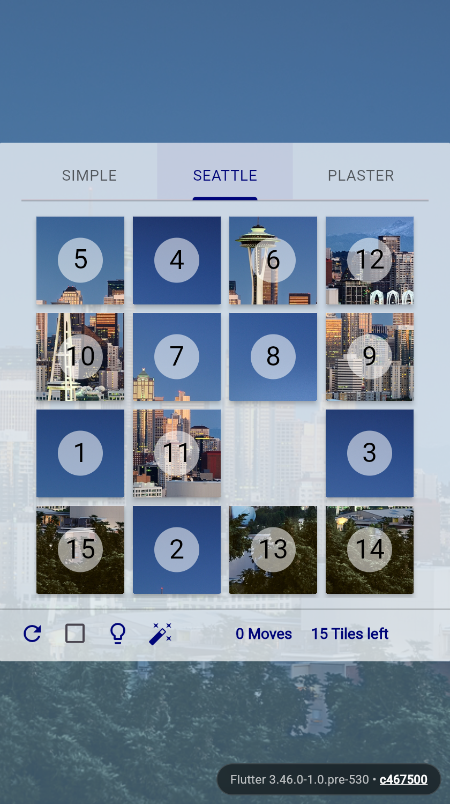

# slide_puzzle

A slide (15) puzzle implemented in Dart and Flutter.

**Live Demo**: [https://kevmoo.github.io/slide_puzzle/](https://kevmoo.github.io/slide_puzzle/)

<p align="center">
  
</p>

## Features

* **Multiple Themes**:
  * **Simple**: Minimalist numerical tiles with smooth physics animations.
  * **Seattle**: Image-based slider dividing photography across the grid.
  * **Plaster**: Stylized typographic display using custom font geometry.
* **Physics & Animations**: Spring simulation, velocity decay, and directional
  drag physics.
* **Built-in Solver**:
  * Shortest-path A* solver utilizing Manhattan distances and linear conflicts.
  * Step-by-step hint button and automated playback solve mode.
* **Auto-Play & Metrics**: Automatic random move ticker with move and tile
  counters.

## Architecture

* **High-Performance Nibble Packing**: Boards $\le 4 \times 4$ use `_PuzzleSmart`
  backed by a `Uint32List` packed into 4-bit nibbles for zero-allocation state
  transitions.
* **Incremental Delta Tracking**: Tile movements calculate distance deltas and
  linear conflict adjustments incrementally without full board rescans.
* **Generic Fallback**: Arbitrary board dimensions ($>16$ tiles, e.g. 5×5)
  gracefully fall back to `_PuzzleSimple` (`Uint8List`).

## Development

```bash
# Run locally in Chrome
flutter run -d chrome

# Run test suite
flutter test

# Run tests with coverage
flutter test --coverage
```
